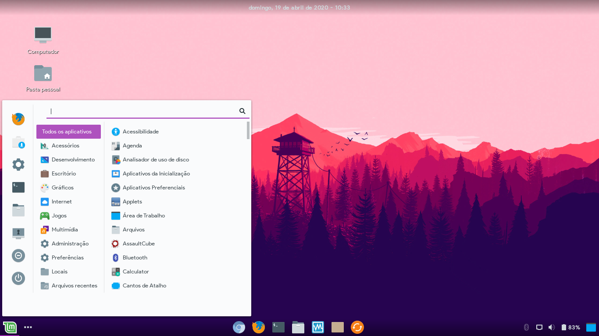

# Adapta-Gtk-Theme

Modified version of <a href="https://github.com/ivankra/adapta-gtk-theme-colorpack">Adapta-gtk-theme-colorpack</a> created by <a href="https://github.com/ivankra">Ivankra</a> 

Bookmarks have been added to the panel that shows which apps are open, this option has been added in Cinnamon!

Soon, I finish the other versions of the theme, in this case, the other colors!

This version contains only the green version!

The diff command was used to know which commands were missing! A comparison was made with the normal Adapta cinnamon.js with a modified Adapta!

# Instalation

Put all files in /usr/share/themes (my preference) or in a folder of your own!

# Images

