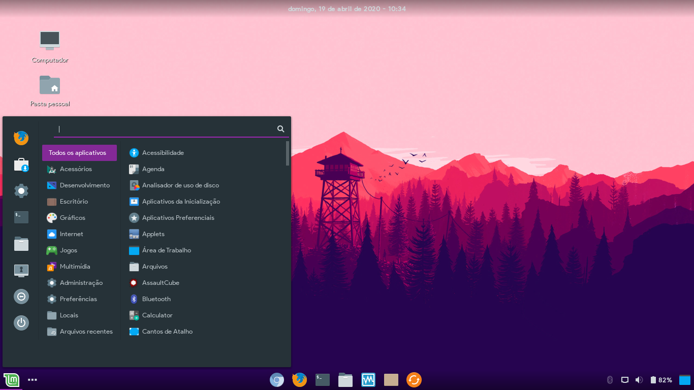

 Adapta Colorpack
=====

Modified version of <a href="https://github.com/adapta-project/adapta-gtk-theme">Adapta Theme</a> created by <a href="https://github.com/adapta-project">Adapta Project</a>

This theme use the ideia of <a href="https://github.com/adapta-project/adapta-gtk-theme">Adapta Colorpack</a> created by <a href="https://github.com/ivankra">Ivankra</a>, the main objective of this theme is the correction of missing things in stock and Ivankra version!

## Modifications in relation of Ivanka and stock version

 - Open app indicators have been added to the cinnamon dashboard
 - The parts were corrected with dark chromium colors, in light themes, such as the close tab button and create a new tab
 - Some icons of the gtk-2.0, gtk-3.0 and gtk-3.22 interfaces are with selection colors according to the theme
 - Standardization of white and dark tones in the theme!
 - The color of the selection in cinnamon has a strong tone, in the menu, with selection of favorites, categories and apps, and, in the panel, with the selection of instances of apps!
 - New visual for close button in gtk-3.0, gtk-3.22, metacity and xfwm4!
 - The theme now use the system font!

## Suported DEs
 - Xfce4
 - Cinnamon
 - Mate
 - Gnome
 - Budgie
 - LXDE

## Available colors (in light and nokto versions)

 - Blue
 - Bluegrey
 - Deeporange
 - Cyan
 - Amber
 - Teal
 - Indigo
 - Green

## Instalation

For Debian, Ubuntu or distribution based on them, use the deb file in <a href="https://github.com/Joshaby/Adapta-Colorpack/releases">Adapta Releases</a>, otherwise, run the Install.sh file!

## Images

## License

GNU GPL v2
