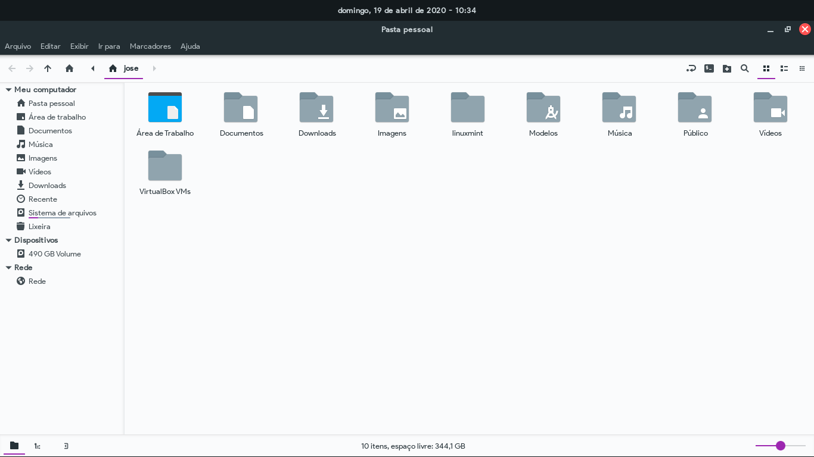

# Adapta-Colorpack

Modified version of <a href="https://github.com/ivankra/adapta-gtk-theme-colorpack">Adapta-gtk-theme-colorpack</a> created by <a href="https://github.com/ivankra">Ivankra</a>

Modifications:

    - Open app indicators have been added to the cinnamon dashboard
    - The parts were corrected with dark chrome colors, in light themes, such as the close tab button and create a new tab
    - Some icons of the gtk-2.0, gtk-3.0 and gtk-3.22 interfaces are with selection colors according to the theme

Soon, I finish the other versions of the theme, in this case, the other colors!

This version not have the Eta version!

Available colors (in light and nokto versions):

    - Blue
    - Bluegrey
    - Deeporange
    - Cyan
    - Amber

# Instalation

For Debian, Ubuntu or distribution based on them, use the deb file in <a href="https://github.com/Joshaby/Adapta-Colorpack/releases">Adapta Releases</a>, otherwise, run the Install.sh file!

# Images

